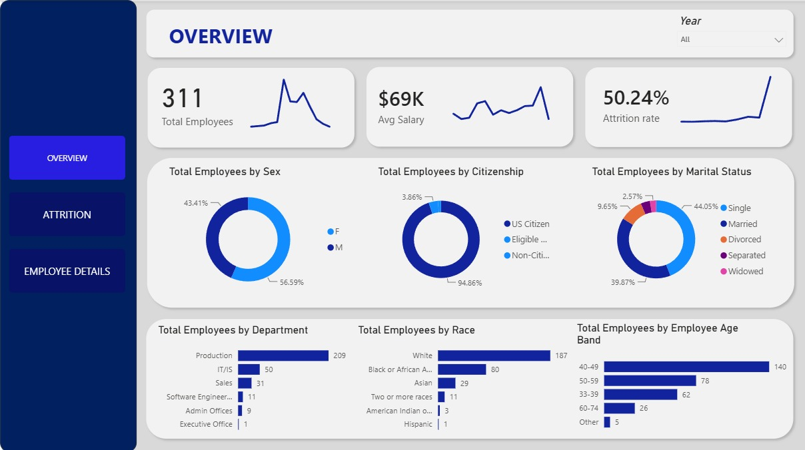
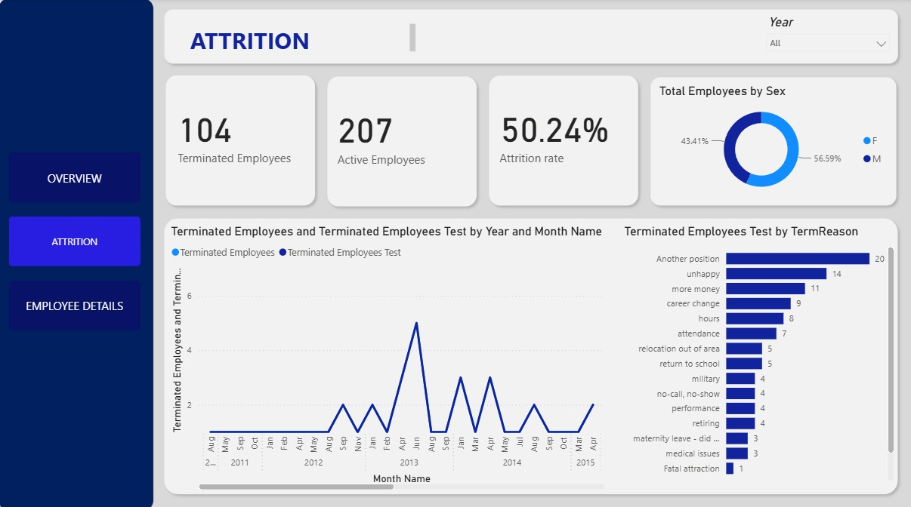
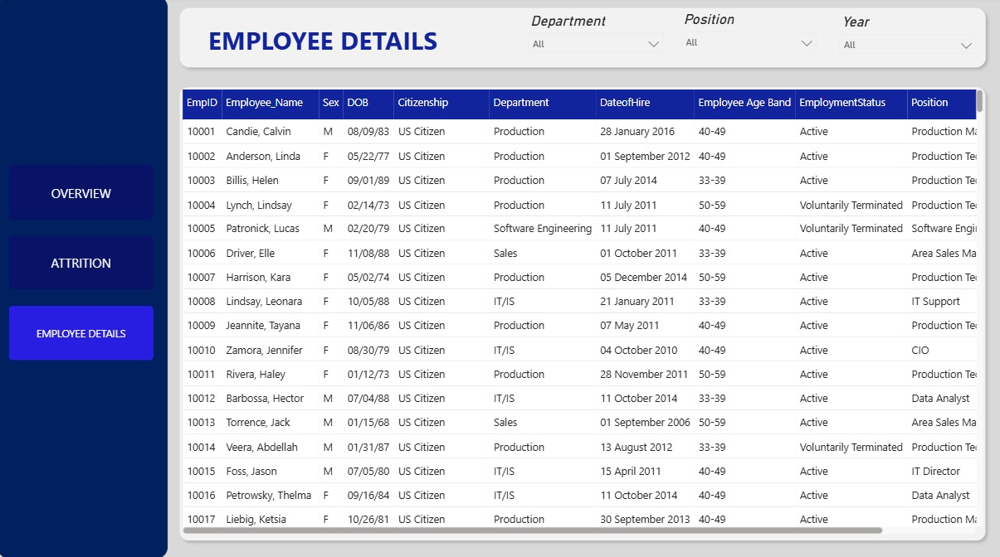
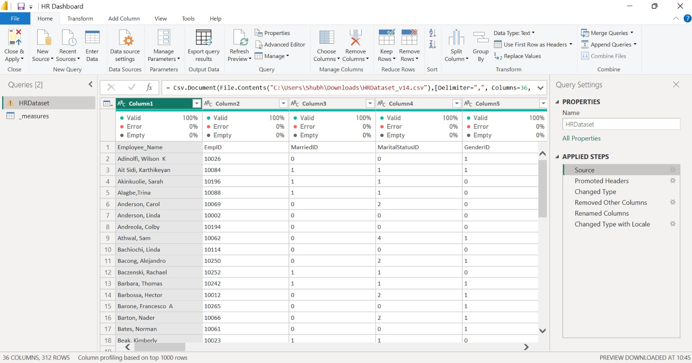
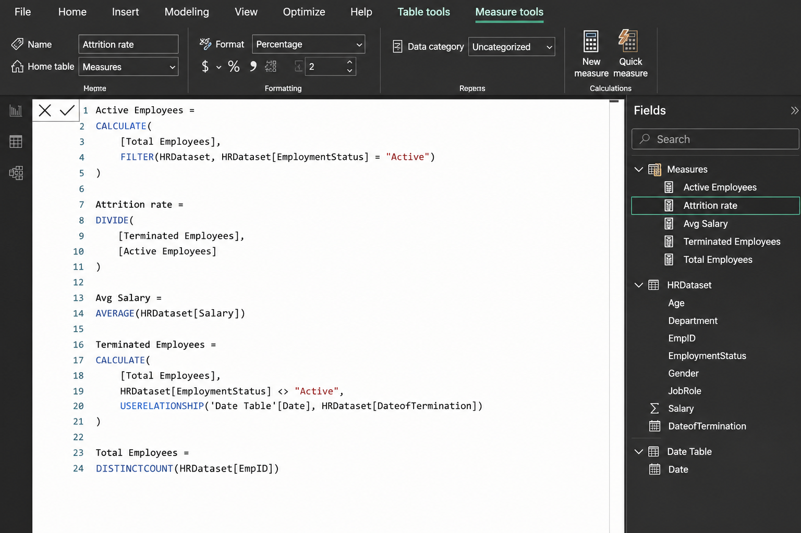
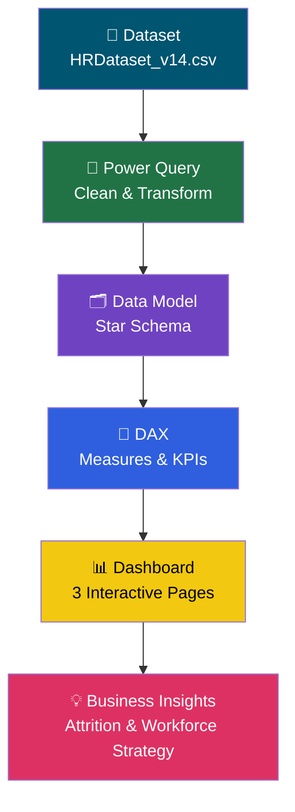
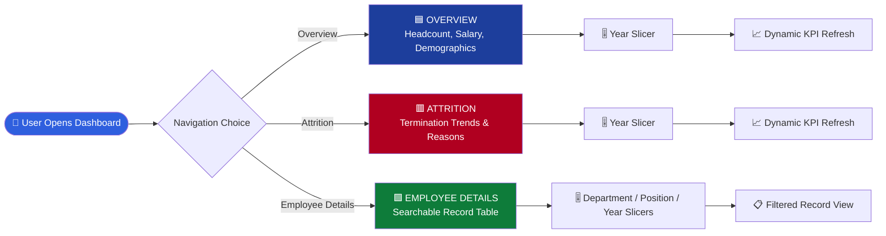

<div align="center">

# 📊 HR Analytics Dashboard — Power BI

### *Turning Raw Employee Data into Strategic Workforce Intelligence*


<br/>

[](https://powerbi.microsoft.com/)
[](https://learn.microsoft.com/en-us/dax/)
[](https://learn.microsoft.com/en-us/power-query/)
[](#-data-model--star-schema)
[](HRDataset_v14.csv)


</div>

<br/>

<div align="center">

</div>

<br/>

---

## 📌 Table of Contents

<details>
<summary><b>Click to expand full navigation</b></summary>

- [🧠 Introduction](#-introduction)
- [❗ Business Problem Statement](#-business-problem-statement)
- [🎯 Project Objectives](#-project-objectives)
- [🖥️ Dashboard Preview](#️-dashboard-preview)
- [✨ Dashboard Features](#-dashboard-features)
- [📈 Key Performance Indicators (KPIs)](#-key-performance-indicators-kpis)
- [💡 Business Insights](#-business-insights)
- [🔄 Power Query Process](#-power-query-process)
- [🧮 DAX Measures](#-dax-measures)
- [🗂️ Data Model — Star Schema](#️-data-model--star-schema)
- [🖼️ Power Query Screenshot Walkthrough](#️-power-query-screenshot-walkthrough)
- [🧮 DAX Screenshot Walkthrough](#-dax-screenshot-walkthrough)
- [📁 Folder Structure](#-folder-structure)
- [🛠️ Tech Stack](#️-tech-stack)
- [🔗 Data Flow Architecture](#-data-flow-architecture)
- [🧭 Dashboard Workflow](#-dashboard-workflow)
- [▶️ How to Run This Project](#️-how-to-run-this-project)
- [🚀 Future Improvements](#-future-improvements)
- [🎓 Key Learnings](#-key-learnings)
- [❓ Interview Questions & Answers](#-interview-questions--answers)
- [⚡ Performance Optimizations](#-performance-optimizations)
- [💼 Business Impact](#-business-impact)
- [📊 Repository Statistics](#-repository-statistics)
- [⭐ Support This Project](#-support-this-project)
- [🤝 Connect With Me](#-connect-with-me)
- [📄 License](#-license)

</details>

---

## 🧠 Introduction

Employee attrition is one of the most expensive, most avoidable problems a company can face — yet most HR teams still track it in static spreadsheets that go stale the moment they're exported.

This project is an **end-to-end Power BI HR Analytics solution** built on a real 311-record employee dataset (`HRDataset_v14.csv`). It takes raw, messy CSV data through **Power Query transformation**, into a clean **star-schema data model**, powered by **custom DAX measures**, and finally into a **3-page interactive dashboard** covering workforce composition, attrition, and individual employee records.

> 💬 *"Anyone can build a chart. This project is about building a decision-making tool."*

The goal wasn't just to visualize numbers — it was to simulate the exact workflow a real BI Analyst follows inside a company: **Import → Clean → Model → Calculate → Visualize → Recommend.**

---

## ❗ Business Problem Statement

> HR leadership at a mid-sized organization needs a single source of truth to answer:
>
> - How many employees do we currently have, and how is the workforce distributed?
> - What does our attrition rate actually look like, and **why** are people leaving?
> - Which departments, roles, and demographics are most affected by turnover?
> - Can we drill into individual employee records without opening a spreadsheet?

Without a centralized, refreshable dashboard, this HR team was relying on manual Excel exports — slow to update, error-prone, and impossible to filter dynamically by department, position, or year.

**This dashboard solves that problem** by turning a static CSV into a live, interactive, filterable analytics tool.

---

## 🎯 Project Objectives

- ✅ Import and clean raw HR data using **Power Query**
- ✅ Design a clean, scalable **star-schema data model**
- ✅ Build **reusable DAX measures** for core HR KPIs
- ✅ Design a **3-page interactive report** (Overview, Attrition, Employee Details)
- ✅ Enable **dynamic filtering** by Year, Department, and Position
- ✅ Surface **actionable business insights**, not just charts
- ✅ Present the entire workflow in a way that's **interview-ready** and **portfolio-ready**

---

## 🖥️ Dashboard Preview

### 🟦 Page 1 — Overview

<div align="center">

</div>

A high-level workforce snapshot: total headcount, average salary, attrition rate, and demographic breakdowns by sex, citizenship, marital status, department, race, and age band — all filterable by year.

<br/>

### 🟦 Page 2 — Attrition Analysis

<div align="center">

</div>

A focused view into workforce turnover: terminated vs. active employee counts, attrition rate trend by month/year, and a ranked breakdown of **termination reasons** — the most valuable diagnostic view in the whole report.

<br/>

### 🟦 Page 3 — Employee Details

<div align="center">

</div>

A searchable, filterable employee-level data table (Department / Position / Year slicers) for HR staff who need to drill down to an individual record.

---

## ✨ Dashboard Features

| Feature | Description |
|---|---|
| 🔎 **Cross-page slicers** | Year filter on every page, plus Department/Position filters on the Employee Details page |
| 🎨 **Consistent visual theme** | Navy sidebar navigation, card-style KPI tiles, unified color palette across all 3 pages |
| 📊 **Multi-chart storytelling** | Donut charts, horizontal bar charts, line trend charts, and a searchable data table |
| 🧭 **Custom page navigation** | Button-based navigation bar (Overview / Attrition / Employee Details) instead of default PBI tabs |
| 📐 **Dynamic KPI cards** | Total Employees, Avg Salary, and Attrition Rate recalculate instantly based on active filters |
| 🧩 **Relationship-aware DAX** | Uses `USERELATIONSHIP` to correctly evaluate termination dates against an inactive relationship |
| 📱 **Clean, recruiter-friendly UI** | Minimalist card design with soft shadows, avoids visual clutter |

---

## 📈 Key Performance Indicators (KPIs)

<div align="center">

| KPI | Value | What It Tells Us |
|---|---|---|
| 👥 **Total Employees** | `311` | Total distinct headcount in the dataset |
| 🟢 **Active Employees** | `207` | Employees currently employed |
| 🔴 **Terminated Employees** | `104` | Employees who have exited the company |
| 📉 **Attrition Rate** | `50.24%` | Terminated ÷ Active — a critical HR health signal |
| 💰 **Average Salary** | `$69K` | Average compensation across the workforce |

</div>

---

## 💡 Business Insights

Based on the dashboard's Overview and Attrition pages:

- 📌 **Production is the largest department by far** — 209 of 311 employees (~67%), meaning any attrition here has an outsized impact on operations.
- 📌 **Attrition sits at 50.24%**, which is unusually high — this signals a workforce retention issue that HR leadership should treat as a priority, not a footnote.
- 📌 **"Another position" is the #1 reason employees leave (20 cases)**, followed by general unhappiness (14) and better pay elsewhere (11) — together these three reasons account for nearly half of all exits, pointing toward **compensation and career growth** as the core retention levers.
- 📌 **The workforce skews heavily toward US Citizens (94.86%)** and is fairly balanced by sex (56.59% M / 43.41% F).
- 📌 **The 40–49 age band is the largest group (140 employees)**, suggesting a mid-career-heavy workforce — succession planning and internal mobility should be a focus area.
- 📌 **Attrition spiked sharply mid-2013**, visible as a clear outlier peak in the monthly trend line — worth a root-cause investigation (policy change, leadership change, layoffs, etc.).
- 📌 Voluntary exits like "retiring," "military," and "maternity leave" are relatively rare (3–4 cases each) compared to controllable reasons like pay and career change — meaning **most attrition here is preventable**, not natural.

---

## 🔄 Power Query Process

All data cleaning happened **before** the data ever touched a chart — this is the foundation that makes every downstream DAX measure trustworthy.

<details>
<summary><b>🔽 Click to expand the full step-by-step Power Query breakdown</b></summary>

### 1️⃣ Source
**What:** `Home → Get Data → Text/CSV → HRDataset_v14.csv`
**Why:** Imports the raw HR employee dataset into Power BI as the starting query.

### 2️⃣ Promoted Headers
**What:** `Home → Use First Row as Header`
**Why:** The raw CSV loaded with generic names like `Column1`, `Column2`. This step promotes the first row into proper field names like `Employee_Name`, `EmpID`, `Salary`.

### 3️⃣ Changed Type
**What:** Verified and corrected automatic type detection —
- `Salary` → Whole Number
- `Employee_Name` → Text
- `DateofHire` → Date
- `EmpID` → Whole Number

**Why:** Power BI needs correct data types for filtering, sorting, aggregating, and charting to work properly.

### 4️⃣ Removed Other Columns
**What:** Kept only the columns required for the dashboard; removed the rest.
**Why:** The raw dataset had many columns that weren't needed for this analysis. Trimming them down improves load performance and keeps the model easy to navigate.

### 5️⃣ Renamed Columns
**What:** e.g. `Employee Name` → `Employee_Name`
**Why:** Clean, consistent naming conventions make columns easier to reference inside DAX formulas and reduce ambiguity.

### 6️⃣ Changed Type with Locale
**What:** `Right-click date column → Change Type → Using Locale → Date → English (United States)`
**Why:** Date formats vary by region. Without explicitly setting the locale, a date like `07/10/83` could be misread (day vs. month swapped). Locale-aware typing guarantees dates are parsed correctly.

### 7️⃣ Close & Apply
**What:** `Home → Close & Apply`
**Why:** Commits all transformation steps and loads the cleaned dataset into the Power BI data model.

</details>

> 🗒️ Full interview-style notes for every step are documented in [`Power Query in My HR Analytics Dashboard (Interview Notes).pdf`](<Power_Query_in_My_HR_Analytics_Dashboard__Interview_Notes_.pdf>)

---

## 🧮 DAX Measures

All measures live in a dedicated `_measures` table (created via `Enter Data → Empty Table`) to keep the model clean and separate from raw data columns.

<details>
<summary><b>📊 Total Employees</b></summary>

```dax
Total Employees =
DISTINCTCOUNT(HRDataset[EmpID])
```

**Purpose:** Counts unique employees using `EmpID` as the distinct key — the base measure that every other headcount calculation builds on.

</details>

<details>
<summary><b>🟢 Active Employees</b></summary>

```dax
Active Employees =
CALCULATE(
    [Total Employees],
    FILTER(
        HRDataset,
        HRDataset[EmploymentStatus] = "Active"
    )
)
```

**Purpose:** Filters the base headcount measure down to only employees whose current status is `"Active"`.

</details>

<details>
<summary><b>🔴 Terminated Employees</b></summary>

```dax
Terminated Employees =
CALCULATE(
    [Total Employees],
    HRDataset[EmploymentStatus] <> "Active",
    USERELATIONSHIP(
        'Date Table'[Date],
        HRDataset[DateofTermination]
    )
)
```

**Purpose:** Counts every employee whose status is *not* Active. Because the model already has an active relationship between the Date Table and `DateofHire`, this measure explicitly activates the **inactive relationship** to `DateofTermination` using `USERELATIONSHIP` — so date-based filtering (e.g. Year slicer) applies correctly to termination dates instead of hire dates.

</details>

<details>
<summary><b>📉 Attrition Rate</b></summary>

```dax
Attrition Rate =
DIVIDE(
    [Terminated Employees],
    [Active Employees]
)
```

**Purpose:** Uses `DIVIDE()` instead of the `/` operator to safely handle division and avoid divide-by-zero errors — a core DAX best practice.

</details>

<details>
<summary><b>💰 Avg Salary</b></summary>

```dax
Avg Salary =
AVERAGE(HRDataset[Salary])
```

**Purpose:** Calculates the average salary across the current filter context — reused across all three report pages.

</details>

### 🧩 Why these measures exist

| Measure | Business Reason |
|---|---|
| `Total Employees` | Foundational headcount metric used across every page |
| `Active Employees` | Needed to isolate the current, working population |
| `Terminated Employees` | Powers the entire Attrition page and trend analysis |
| `Attrition Rate` | The single most important HR retention KPI |
| `Avg Salary` | Gives leadership a compensation benchmark alongside headcount |

---

## 🗂️ Data Model — Star Schema

<div align="center">

</div>

This project follows a clean **Star Schema** design — the gold standard for Power BI performance and DAX simplicity:

- **`HRDataset`** — the central **fact table**, holding one row per employee (EmpID, Department, Citizenship, DateofHire, DateofTermination, Employee Age, Employee Age Band, Employee_Name, DOB, etc.)
- **`Date Table`** — a supporting **dimension table** (Date, Month Name, Month Number, Year), joined to `HRDataset` on two separate date columns

### Why two relationships to one Date Table?

`HRDataset` contains **two** date fields that both need to filter by calendar (`DateofHire` and `DateofTermination`), but a table can only have **one active relationship** to another table at a time. So this model:

- Sets `DateofHire ↔ Date` as the **active** relationship (used by default for hire-based date filtering)
- Sets `DateofTermination ↔ Date` as an **inactive** relationship, activated on-demand inside the `Terminated Employees` measure via `USERELATIONSHIP()`

This is a textbook **role-playing dimension** pattern, and it's exactly why the `Terminated Employees` DAX measure needed that extra `USERELATIONSHIP` line — without it, the Year slicer on the Attrition page would silently apply to the wrong date column.

---

## 🖼️ Power Query Screenshot Walkthrough

<div align="center">

</div>

Reading the **Applied Steps** panel (right side) top to bottom, this is exactly the transformation pipeline described above, executed on `HRDataset_v14.csv`:

| # | Applied Step | What Happened |
|---|---|---|
| 1 | **Source** | Connected to the CSV file via `Csv.Document(File.Contents(...))` |
| 2 | **Promoted Headers** | Turned row 1 into actual column headers |
| 3 | **Changed Type** | Auto-detected + verified column data types |
| 4 | **Removed Other Columns** | Dropped unused columns, keeping only what the dashboard needed |
| 5 | **Renamed Columns** | Cleaned up column names for DAX-friendliness |
| 6 | **Changed Type with Locale** | Forced `English (United States)` locale on date fields to avoid misread dates |

The query pane also shows a second query, **`_measures`** — the empty table created specifically to house all DAX measures separately from the raw data table, keeping the **Fields** list organized and professional.

---

## 🧮 DAX Screenshot Walkthrough

<div align="center">

</div>

This screenshot shows all 5 measures written inside the **Measures** table, visible in the **Fields** pane on the right (`Active Employees`, `Attrition rate`, `Avg Salary`, `Terminated Employees`, `Total Employees`), sitting cleanly separate from the raw `HRDataset` and `Date Table` fields below them.

**Why each measure was created:**

- `Total Employees` → needed as the **base building block** for every other headcount KPI
- `Active Employees` → isolates the current workforce for the Overview page KPI card
- `Terminated Employees` → powers the Attrition page and requires the `USERELATIONSHIP` fix to read termination dates correctly
- `Attrition Rate` → the flagship KPI of the entire project — turns two raw counts into one decision-ready percentage
- `Avg Salary` → gives every page a compensation benchmark without needing a separate calculation each time

Keeping these measures in a dedicated table (rather than scattered inside `HRDataset`) is a modeling best practice that keeps the field list clean and makes measures easy to find and maintain.

---

## 📁 Folder Structure

```bash
HR-Analytics-Dashboard-PowerBI/
│
├── 📄 README.md                                                  # You are here
├── 📜 LICENSE                                                    # MIT License
│
├── 📊 HR Dashboard.pbix                                          # Main Power BI project file
├── 📕 HR Dashboard PDF.pdf                                        # Exported dashboard (PDF)
├── 📁 HRDataset_v14.csv                                          # Source dataset (311 employee records)
│
├── 🖼️ HR1.jpeg                                                    # Screenshot — Overview page
├── 🖼️ HR2.jpeg                                                    # Screenshot — Attrition page
├── 🖼️ HR3.jpeg                                                    # Screenshot — Employee Details page
│
├── 🧮 DAX_Used.png                                                # Screenshot — DAX measures panel
├── 🔄 HRPower_Query.jpeg                                          # Screenshot — Power Query applied steps
├── 🗂️ HRData_Model_.jpeg                                          # Screenshot — Star schema data model
│
└── 📓 Power Query in My HR Analytics Dashboard (Interview Notes).pdf   # Full Q&A-style documentation
```

---

## 🛠️ Tech Stack

<div align="center">

| Tool | Purpose |
|:---:|---|
|  | Dashboard design & interactive visualizations |
|  | Data import, cleaning, and transformation |
|  | Calculated measures and KPIs |
|  | Star schema design & relationship management |
|  | Raw source data (`HRDataset_v14.csv`) |

</div>

---

## 🔗 Data Flow Architecture



---

## 🧭 Dashboard Workflow



---

## ▶️ How to Run This Project

```bash
# 1. Clone the repository
git clone https://github.com/Shubhh23/HR-Analytics-Dashboard-PowerBI.git

# 2. Navigate into the project folder
cd HR-Analytics-Dashboard-PowerBI

# 3. Open the Power BI file
# Double-click: HR Dashboard.pbix
# (Requires Power BI Desktop — free download from Microsoft)
```

**Requirements:**
- [Power BI Desktop](https://powerbi.microsoft.com/desktop/) (free, Windows only)
- `HRDataset_v14.csv` present in the same directory (or update the data source path via `Transform Data → Data Source Settings`)

> ⚠️ If the report opens with a data source error, go to **Transform Data → Manage Parameters / Data Source Settings** and point it to your local copy of `HRDataset_v14.csv`.

---

## 🚀 Future Improvements

- 🔮 Add **predictive attrition modeling** using Power BI's built-in AI visuals or Python/R integration
- 🔮 Introduce **what-if parameters** to simulate salary/retention scenarios
- 🔮 Connect to a **live database** (SQL Server / Azure) instead of a static CSV for real-time refresh
- 🔮 Add **row-level security (RLS)** so department managers only see their own team's data
- 🔮 Build a **tooltip page** for deeper drill-through on department-level attrition
- 🔮 Publish to the **Power BI Service** with a scheduled refresh

---

## 🎓 Key Learnings

- 📘 How to structure a proper **star schema** and why role-playing dimensions require `USERELATIONSHIP`
- 📘 Why `DIVIDE()` is safer than the `/` operator in production DAX
- 📘 How **Power Query locale settings** silently affect date accuracy across regions
- 📘 The importance of a **dedicated measures table** for a clean, maintainable model
- 📘 How to design a **multi-page navigation experience** using buttons instead of default tabs
- 📘 How to translate raw HR data into **insights a non-technical stakeholder can act on**

---

## ❓ Interview Questions & Answers

<details>
<summary><b>Q1. Why did you use Power Query instead of cleaning the data in Excel?</b></summary>

Excel cleaning is manual and has to be redone every time the source data changes. Power Query automates the entire cleaning pipeline — if the source data refreshes, I just click **Refresh**, and every transformation step (headers, types, column removal, renaming, locale) reapplies automatically.
</details>

<details>
<summary><b>Q2. Why did you need <code>USERELATIONSHIP</code> in your Terminated Employees measure?</b></summary>

Because `HRDataset` has two date columns (`DateofHire` and `DateofTermination`) that both relate to the same `Date Table`, only one relationship can be active at a time. `DateofHire` was set active by default, so I used `USERELATIONSHIP()` inside the measure to explicitly activate the `DateofTermination` relationship — ensuring the Year slicer filters terminations correctly instead of hires.
</details>

<details>
<summary><b>Q3. What's the difference between Power Query and DAX?</b></summary>

Power Query cleans and shapes data **before** it loads into the model (import-time), while DAX calculates values and KPIs **after** the data is loaded (query-time). Power Query answers "what should the data look like?" — DAX answers "what can I calculate from it?"
</details>

<details>
<summary><b>Q4. Why did you create a separate <code>_measures</code> table?</b></summary>

To keep the data model clean and organized. Storing every DAX measure in a dedicated empty table (instead of attaching them to `HRDataset`) makes the Fields pane easier to navigate and clearly separates raw data from calculated logic.
</details>

<details>
<summary><b>Q5. Why is your Attrition Rate formula written with <code>DIVIDE()</code> instead of the standard division operator?</b></summary>

`DIVIDE()` automatically handles divide-by-zero scenarios by returning `BLANK()` (or an optional default) instead of throwing an error — which matters when filters could reduce the `Active Employees` count to zero.
</details>

<details>
<summary><b>Q6. Why did you use "Changed Type with Locale" instead of a normal type change?</b></summary>

Date formats differ by region (day/month order), and Power BI can misinterpret ambiguous dates like `07/10/83` without an explicit locale. Setting the locale to `English (United States)` guarantees dates are parsed consistently and correctly.
</details>

---

## ⚡ Performance Optimizations

- 🧹 **Removed unused columns** in Power Query to reduce the in-memory model size
- 🧮 **Centralized measures** in a single `_measures` table to avoid duplicated logic across visuals
- 🔗 **Star schema design** (instead of a flat/wide table) keeps relationships simple and query performance fast
- 🎯 Used `CALCULATE` + `FILTER` precisely rather than nested iterators, keeping DAX evaluation efficient
- 🗓️ Correctly typed date columns at the Power Query layer instead of relying on runtime conversions inside DAX

---

## 💼 Business Impact

This dashboard gives HR and business leadership the ability to:

- **Identify attrition hotspots** by department, role, and demographic in seconds instead of hours of manual Excel work
- **Quantify the cost of turnover** using a live Attrition Rate KPI instead of a once-a-quarter static report
- **Prioritize retention initiatives** based on real termination reasons (career growth, compensation, unhappiness) rather than assumptions
- **Support headcount planning** using accurate, filterable demographic breakdowns
- **Reduce reporting turnaround time** from days (manual spreadsheet exports) to seconds (interactive filtering)

---

## 📊 Repository Statistics

<div align="center">


</div>

---

## ⭐ Support This Project

If this project helped you understand Power BI, DAX, or Power Query a little better — consider giving it a ⭐!

> It genuinely helps the project reach more learners and recruiters, and it keeps me motivated to build more projects like this.

<div align="center">

### 👉 [Star this repository](https://github.com/Shubhh23/HR-Analytics-Dashboard-PowerBI) 👈

</div>

---

## 🤝 Connect With Me

<div align="center">

[](https://www.linkedin.com/in/shubh-chak-b01a793b0)
[](https://github.com/Shubhh23)

</div>

---

## 📄 License

This project is licensed under the **MIT License** — see the [LICENSE](LICENSE) file for details.

---

<div align="center">

### 💙 Built with precision, curiosity, and a lot of DAX debugging.

*If you're a recruiter reading this — thank you for taking the time to go through the full project. I'd love to talk about how I built it.*

**⭐ Star this repo · 🍴 Fork it · 📩 Reach out**

</div>
